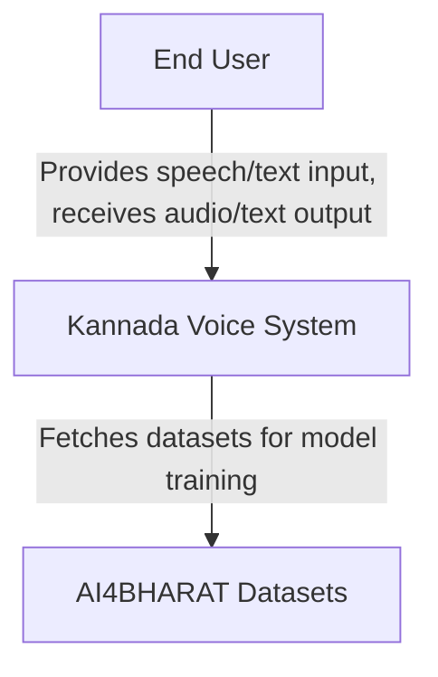

# C4 Model: Kannada Voice Model Development Demo

This document presents the C4 model (Context, Containers, Components, and Code) for the Kannada Voice Model Development Demo. It describes the system's architecture at varying levels of detail, from its interaction with external entities to the internal code structure, aligning with the goal of creating a robust voice assistant for Kannada speakers.

## Level 1: Context Diagram



- **End User**: A Kannada speaker interacting with the system via speech or text input.
- **Kannada Voice System**: The core system providing ASR, TTS, and translation services.
- **AI4BHARAT Datasets**: External data source for training and fine-tuning models.

### Interactions
- **End User → System**: Provides speech/text input, receives audio/text output.
- **System → AI4BHARAT**: Fetches datasets for model training.

## Level 2: Container Diagram

### Description
The Container Diagram breaks the Kannada Voice System into its major deployable units (containers) and their interactions, hosted on a cloud GPU infrastructure.

### Diagram

```mermaid
graph TD
    A[End User] -->|HTTP requests/responses| B[API Server (Flask/FastAPI)]
    B -->|Internal API calls| C[ASR Container]
    B -->|Internal API calls| D[TTS Container]
    B -->|Internal API calls| E[Translation Container]
    C -->|Leverage GPU for model execution| F[GPU Instance (e.g., RTX 4090)]
    D -->|Leverage GPU for model execution| F
    E -->|Leverage GPU for model execution| F
    C -->|Fetch training data during development| G[AI4BHARAT Datasets]
    D -->|Fetch training data during development| G
    E -->|Fetch training data during development| G
```

- **API Server**: Handles user requests and routes them to appropriate containers.
- **ASR Container**: Processes speech-to-text functionality.
- **TTS Container**: Processes text-to-speech functionality.
- **Translation Container**: Handles text translation between languages.
- **GPU Instance**: Cloud-based GPU (e.g., Vast.ai RTX 4090) for model inference and training.

### Interactions
- **End User ↔ API Server**: HTTP requests/responses (e.g., audio upload, text/audio download).
- **API Server ↔ Containers**: Internal API calls to process ASR, TTS, or translation.
- **Containers ↔ GPU Instance**: Leverage GPU for model execution.
- **Containers ↔ AI4BHARAT Datasets**: Fetch training data during development.

## Level 3: Component Diagram

### Description
The Component Diagram zooms into the containers, detailing the internal components and their interactions within the Kannada Voice System.

### Diagram

```mermaid
graph TD
    A[API Server] -->|Routes requests to specific endpoints| B[/asr]
    A -->|Routes requests to specific endpoints| C[/tts]
    A -->|Routes requests to specific endpoints| D[/translate]
    B -->|Speech-to-text requests| E[ASR Container]
    C -->|Text-to-speech requests| F[TTS Container]
    D -->|Translation requests| G[Translation Container]
    E -->|ASR Model| H[ASR Model]
    E -->|Audio Processing| I[Audio Proc.]
    F -->|TTS Model| J[TTS Model]
    F -->|Text Processing| K[Text Proc.]
    G -->|Translation Model| L[Trans Model]
    G -->|Text Processing| M[Text Proc.]
    H -->|Runs inference on GPU| N[GPU Instance]
    I -->|Runs inference on GPU| N
    J -->|Runs inference on GPU| N
    K -->|Runs inference on GPU| N
    L -->|Runs inference on GPU| N
    M -->|Runs inference on GPU| N
    N -->|PyTorch| O[PyTorch]
    N -->|Torchaudio| P[Torchaudio]
```

- **API Server**:
  - **/asr**: Endpoint for speech-to-text requests.
  - **/tts**: Endpoint for text-to-speech requests.
  - **/translate**: Endpoint for translation requests.
- **ASR Container**:
  - **ASR Model**: Fine-tuned Indic ASR model.
  - **Audio Processing**: Handles audio input (e.g., normalization).
- **TTS Container**:
  - **TTS Model**: Fine-tuned Parler TTS model.
  - **Text Processing**: Prepares text for speech synthesis.
- **Translation Container**:
  - **Translation Model**: Fine-tuned Indic Translate model.
  - **Text Processing**: Tokenizes and formats text.
- **GPU Instance**:
  - **PyTorch**: Framework for model execution.
  - **Torchaudio**: Audio processing library.

### Interactions
- **API Server → Containers**: Routes requests to specific endpoints.
- **ASR Model ↔ Audio Processing**: Converts WAV input to text.
- **TTS Model ↔ Text Processing**: Converts text to WAV output.
- **Translation Model ↔ Text Processing**: Translates text between languages.
- **Containers ↔ GPU Instance**: Use PyTorch and Torchaudio for GPU-accelerated inference.

## Level 4: Code-Level Details (Sample)

### Description
This section provides a high-level pseudocode example for the ASR endpoint, illustrating the integration of components.

### Pseudocode
```python
# File: api_server.py
from flask import Flask, request, jsonify
import torchaudio
from asr_model import ASRModel

app = Flask(__name__)
asr_model = ASRModel.load("indic_asr_kannada.pt")

@app.route("/asr", methods=["POST"])
def process_asr():
    # Receive audio file from user
    audio_file = request.files["audio"]
    waveform, sample_rate = torchaudio.load(audio_file)

    # Preprocess audio
    if sample_rate != 16000:
        waveform = torchaudio.transforms.Resample(sample_rate, 16000)(waveform)

    # Run ASR inference on GPU
    text = asr_model.transcribe(waveform.cuda())

    # Return transcribed text
    return jsonify({"transcription": text})

if __name__ == "__main__":
    app.run(host="0.0.0.0", port=5000)
```

### Specification for Indic Server

### Key Components:
- **ASRModel**: Custom class wrapping the fine-tuned ASR model.
- **torchaudio.load**: Loads WAV input.
- **transcribe**: Runs inference on GPU.

### Dependencies:
- Flask
- PyTorch
- Torchaudio

### Notes:
- Similar code structures apply to `/tts` (using `TTSModel`) and `/translate` (using `TranslationModel`).
- Models are loaded from pre-trained weights fine-tuned on AI4BHARAT datasets.

## Deployment Details

### Cloud Deployment
- **Provider**: OlaKrutrim / Hugginface
- **GPU**: RTX 4090 (1-3 instances based on phase).
- **OS**: Ubuntu 22.04 LTS
- **Cost**: $0.5/hour, total $1,800 over 3 months.

### Development Phases
1. **Month 1**: Single GPU, API setup, model fine-tuning.
2. **Month 2**: Scale to 3 GPUs, multi-user testing.
3. **Month 3**: Full load testing, final demo polish.

## Conclusion

The C4 model provides a comprehensive view of the Kannada Voice System, from its high-level context to detailed code structure. It ensures the demo is architecturally sound, leveraging GPU resources efficiently to deliver real-time ASR, TTS, and translation for Kannada speakers. This model serves as a blueprint for development and deployment over the three-month project timeline.