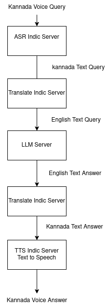
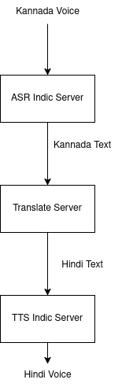

# Project Dhwani: Enhancing Kannada Voice Model Development with GPU Access

## Table of Contents

1. [Summary](#summary)
2. [Introduction](#introduction)
    - [Background](#background)
    - [Objectives](#objectives)
3. [Budget](#budget)
    - [Cloud Providers](#cloud-providers)
    - [On-Premise GPU Setup](#on-premise-gpu-setup)
    - [GPU Access Cost Estimation](#gpu-access-cost-estimation)
4. [Project Scope](#project-scope)
    - [Models and Tools](#models-and-tools)
    - [Current Setup](#current-setup)
5. [Proposed Plan](#proposed-plan)
    - [Phase 1: Cloud Provider setup with Single GPU](#phase-1-cloud-provider-setup-with-single-gpu)
    - [Phase 2: Alpha user scaling with multi-gpu setup ](#phase-2-alpha-user-scaling-with-multi-gpu-setup)
    - [Phase 3: Resource Maximization and Scalability to Beta users](#phase-3-resource-maximization-and-scalability-to-beta-users)
6. [Test Cloud Provider](#test-cloud-provider)
    - [Overview](#overview)
    - [Provider and Costs](#provider-and-costs)
7. [Alternate Cloud Providers for GPU Access](#alternate-cloud-providers-for-gpu-access)
7. [Additional Reading Materials](#additional-reading-materials)
    - [Dhwani - 3 months Milestone Document](#dhwani---3-month---milestone-plan)
    - [Technical Specifications](#technical-specifications)
9. [Conclusion](#conclusion)
10. [Contact Information](#contact-information)

## Summary

Dhwani is a self-hosted GenAI platform designed to provide voice mode interaction for Kannada and other Indian languages. 

## Research Goals

- Measure and improve the Time to First Token Generation (TTFTG) for model architectures in ASR, Translation, and TTS systems.
- Develop and enhance a Kannada voice model that meets industry standards set by OpenAI, Google, ElevenLabs, xAI
- Create robust voice solutions for Indian languages, with a specific emphasis on Kannada.

## Introduction

### Project Website - [https://slabstech.com/dhwani](https://slabstech.com/dhwani)

### Background

Current voice assistants like Alexa, Siri, and Google dominate the consumer market but lack comprehensive support for Indian languages, particularly Kannada. OpenAI's recent entry into the voice assistant market highlights the growing demand for such technologies. By utilizing open-source models and tools, we can develop a voice solution that is accessible and robust, specifically tailored for Kannada speakers.

### Objectives

The primary objective is to integrate and enhance the following models and services for Kannada:
- **Automatic Speech Recognition (ASR)**: To convert spoken Kannada into text.
- **Text-to-Speech (TTS)**: To convert Kannada text into natural-sounding speech.
- **Translation Services**: To enable translation between Kannada and other Indian languages.

### Models and Tools

The project utilizes the following open-source tools:

| Open-Source Tool                       | Source Repository                                          | CPU / Available 24/7 - Free| GPU / On-demand |
|---------------------------------------|-------------------------------------------------------------|----------------|----------------|
| Automatic Speech Recognition : ASR   | [ASR Indic Server](https://github.com/slabstech/asr-indic-server) | [API Demo](https://huggingface.co/spaces/gaganyatri/asr_indic_server_cpu) // [TODO-App Demo](https://huggingface.co/spaces/gaganyatri/asr_indic_app_gradio) |  - |
| Text to Speech : TTS                  | [TTS Indic Server](https://github.com/slabstech/tts-indic-server)  | CPU-not suitable             | [App -Demo](https://huggingface.co/spaces/gaganyatri/tts_indic_local) |
| Translation                           | [Indic Translate Server](https://github.com/slabstech/indic-translate-server) | [API Demo](https://huggingface.co/spaces/gaganyatri/translate_indic_server_cpu) // [App Demo](https://huggingface.co/spaces/gaganyatri/translate_indic_local)          |            |
| Large Language Model                           | [LLM Indic Server](https://github.com/slabstech/llm-indic-server) | [API Demo](https://huggingface.co/spaces/gaganyatri/translate_indic_server_cpu) // [App Demo](https://huggingface.co/spaces/gaganyatri/llm_indic_local_2)         |            |
| Document Parser                           | [Indic Document Server](https://github.com/slabstech/docs-indic-server) | Not Suitable          |    -        |
|All in One Server - ASR + TTS + Translate | [indic-all-server](server/indic_all/) | Not Suitable |  [API Demo ](https://gaganyatri-indic-all-server.hf.space/docs) // [TODO] |

## Target Solution

| Answer Engine                                  | Voice Translation                          |
|-----------------------------------------------|---------------------------------------------|
|  |  |

## Budget

### Cloud Providers

- **Cost**: Estimated $2,880 for three months of cloud-based GPU access.
- **Justification**: Necessary for initial infra setup, model optimization and performance evaluation.

### On-Premise GPU Setup

- **Cost**: $4,000 for hardware and setup: RTX 4090 - Workstation with 24GB VRAM
- **Justification**: Long-term investment for sustainable development and scalability.

We will target implementaion with Single GPU

### GPU Access Cost Estimation

#### Cost Breakdown
| Month | Activity                          | Users | Cost per Hour/GPU ($) | Hours per Day | Daily Cost ($) | Monthly Cost ($) |
|-------|-----------------------------------|-------|-----------------------|---------------|----------------|------------------|
| 1     | Development and optimization      | 1-5   | 0.5                   | 4             | 2.00           | 960              |
| 2     | Scalability tests and beta users | 10-20 | 0.5                   | 24            | 12.00          | 960              |
| 3     | Large scale testing across timezones | 10-20 | 0.5                   | 36            | 18.00          | 960              |

**Total Cost**
- **Total Cost**: $960 + $960 + $960 = $2,880

## Project Scope

### Current Setup

The development is currently being executed on a laptop with a GTX 1060 6GB VRAM. However, to ensure robustness and scalability, additional GPU resources are required.

#### Integrated Demos
- Demo for Testing components for Dhwani for Accuracy and evaluation

| Feature                      | Description                                                                 | Demo Link | Components          | Source Code       | Hardware       |
|------------------------------|-----------------------------------------------------------------------------|-----------|---------------------|-------------------|---------------|
| Kannada Voice AI                | Provides answers to voice queries using a LLM                     | [API Demo](https://huggingface.co/spaces/gaganyatri/dhwani-voice-model) // [App Demo](https://huggingface.co/spaces/gaganyatri/tts_indic_local) | LLM                 | [API](ux/answer_engine/app.py) // [APP](ux/answer_engine/local/app.py)          | CPU / GPU |
| Text Translate               | Translates text from one language to another.                                | [Link](https://huggingface.co/spaces/gaganyatri/dhwani_text_translate)  | Translation         | [Link](ux/text_translate/app.py)          | CPU / GPU | 
| Text Query                   | Allows querying text data for specific information.                          | [Link](https://huggingface.co/spaces/gaganyatri/dhwani_text_query)  | LLM                 | [Link](ux/text_query/app.py)          | CPU / GPU |
| Voice to Text Translation    | Converts spoken language to text and translates it.                          | [Link](https://huggingface.co/spaces/gaganyatri/dhwani)  | ASR, Translation    | [Link](ux/voice_to_text_translation/app.py)          | CPU / GPU |
| PDF Translate                | Translates content from PDF documents.                                       |  | Translation         |           | GPU |
| Text to Speech           | Generates speech from text.                                                  |  [Link](https://huggingface.co/spaces/gaganyatri/tts_dhwani_usecase) | TTS                 | [Link](ux/text_to_speech/app.py)          | GPU |
| Voice to Voice Translation   | Converts spoken language to text, translates it, and then generates speech.   | [Link](https://huggingface.co/spaces/gaganyatri/dhwani-tts)  | ASR, Translation, TTS| [Link](ux/voice_to_voice_translation/app.py)          | GPU |
| Answer Engine with Translate| Provides answers to queries with translation capabilities.                   |   [link](https://huggingface.co/spaces/gaganyatri/dhwani_voice_to_any) | LLM, Translation    | [Link](ux/answer_engine_translate/app.py)          | GPU|

## Proposed Plan

### Phase 1: Cloud Provider setup with Single GPU

- **Objective**: Utilize cloud-based GPU resources to enhance the models.
- **Actions**:
  - Set up and configure cloud-based GPUs.
  - Perform initial training and testing of ASR, TTS, and translation models.
  - Evaluate the performance and make necessary adjustments.

### Phase 2: Alpha user scaling with multi-gpu setup

- **Objective**: Assess the feasibility of multi-GPU solutions.
- **Actions**:
  - Conduct a cost-benefit analysis of multi-GPU setup.
  - Continue model training and optimization using cloud-based GPUs.

### Phase 3: Resource Maximization and Scalability to Beta users

- **Objective**: Release to Beta users with advanced GPU.
- **Actions**:
  - Monitor the performance and resource utilization.
  - Adjust the project plan as needed to ensure efficient use of resources.
  - Seek additional funding or resources based on project progress and demand.

### Test Cloud Provider 

- Huggingface Spaces, 
- OlaKrutrim Cloud

### Provider and Costs

- Huggingface Spaces

Cost from Huggingface Spaces - Ease of Use and model close to server

| GPU Type            | vCPU | Memory | GPU Model | GPU Memory | Price ($) |
|----------------------|------|--------|-----------|------------|-----------|
| Nvidia T4 - small    |  4   | 15 GB  | Nvidia T4 | 16 GB      | $0.40      |
| 1x Nvidia L4         |  8   | 30 GB  | Nvidia L4 | 24 GB      | $0.80      |
| 1x Nvidia L40S       |  8   | 62 GB  | Nvidia L4 | 48 GB      | $1.80      |
| Nvidia A10G - small  |  4   | 15 GB  | Nvidia A10G| 24 GB      | $1.00      |

- OlaKrutrim Cloud

| Instance Type         | Price (₹/hour) | GPUs | Availability | vCPUs | GPU Memory | RAM    |
|-----------------------|----------------|------|-------------|-------|------------|--------|
| A100-NVLINK-Mini      | ₹ 45           | 1    | Medium | 16    | 20 GB      |        |
| A100-NVLINK-Standard-1x| ₹ 105          | 1    | Medium | 16    | 40 GB      | 60 GB  |
| H100-NVLINK-Nano      | ₹ 83           | 1    | Medium | 16    | 20 GB      |        |
| H100-NVLINK-Mini      | ₹ 124          | 1    | Medium      | 16    | 40 GB      | 60 GB  |

- WIP - [Cloud provider benchmark document](https://github.com/sachinsshetty/onwards/blob/main/idea/2025/2025-02-27-cloud-provider-benchmarks.md)

## Additional Reading Materials

### Dhwani - 3 month - Milestone plan

[Dhwani Research Milestone document](https://github.com/sachinsshetty/onwards/blob/main/idea/2025/2025-02-27-dhwani-research-milestones)

### Technical Specifications

For more detailed technical specifications, please refer to the following documents:

- [Technical Specifications for Indic Server](https://github.com/sachinsshetty/onwards/blob/main/idea/2025/2025-02-24-tech-spec-indic-server.md)
- [C4 Specifications for Indic Server](https://github.com/sachinsshetty/onwards/blob/main/idea/2025/2025-02-24-c4-spec-indic-server.md)

## Conclusion

This proposal aims to secure GPU access for three months to develop a robust Kannada/Indic Language voice model. By leveraging open-source tools and models, we can create a solution that meets the needs of Kannada speakers and contributes to the broader field of voice assistant technologies. Your support in providing GPU access will be instrumental in achieving this goal.

## Contact Information

For any inquiries or further discussion, please contact:

- [sachin]

- To collaborate immediately with code, feedback, issues : Join our [Discord Server](https://discord.gg/WZMCerEZ2P)
    - Clear, Small Pull Requests for [Milestones](https://github.com/sachinsshetty/onwards/blob/main/idea/2025/2025-02-27-dhwani-research-milestones) - are worth its weight in Gold

---

We appreciate your consideration and look forward to the possibility of collaborating on this exciting project.

---

